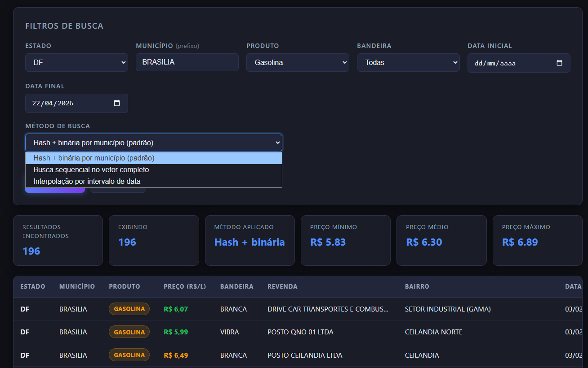
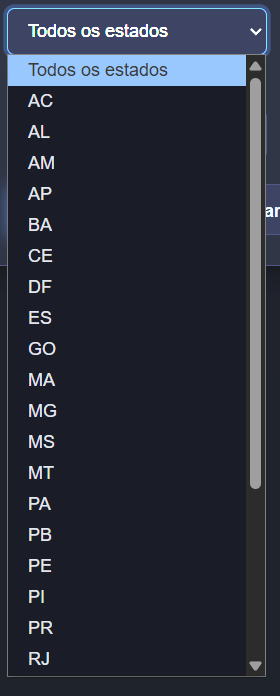
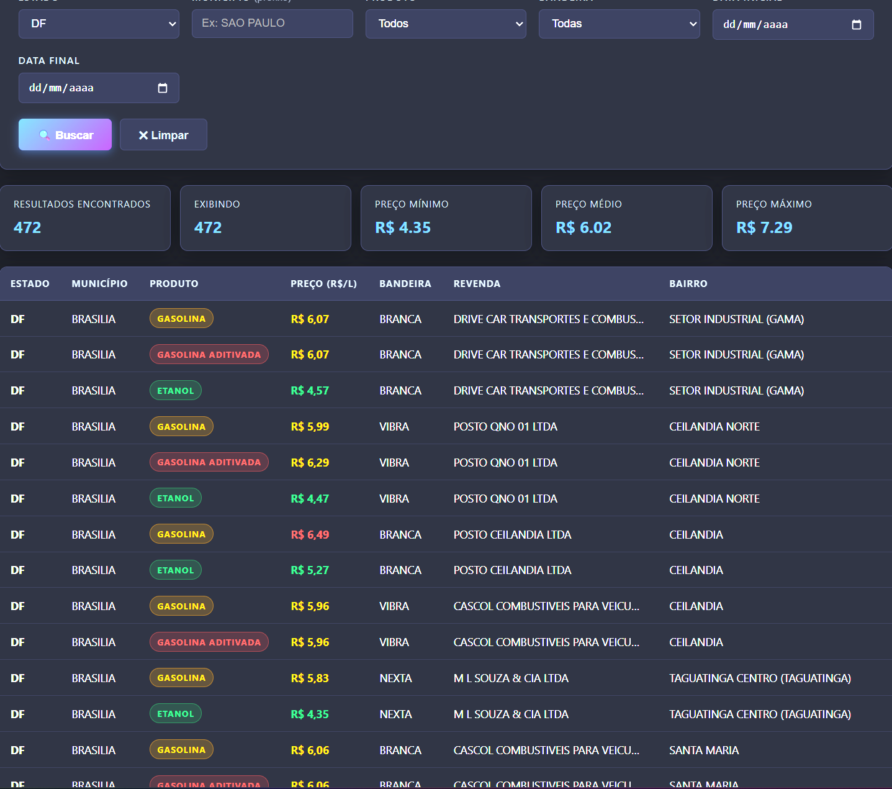

# Busca_PrecosCombustiveis

## Alunos
|Matrícula | Aluno |
| -- | -- |
| 222021826 | Victor Leandro Rocha de Assis |
| 231036980 | Pedro Luiz Fonseca da Silva |

## Sobre 
O projeto é uma aplicação de busca em linguagem C focada em consultar de forma ultrarrápida os dados de preços de combustíveis (Gasolina, Etanol, Aditivada) de postos brasileiros. A base de origem utilizada contém milhares de registros abertos da ANP do mês de fevereiro de 2026. 

Em vez de utilizar uma busca linear simples, o sistema carrega os dados em memória e cria as próprias estruturas do zero: uma **Tabela Hash** aberta (indexando os estados em `O(1)`) e uma ordenação dos buckets com **Quicksort**, que permite buscas interativas de grande precisão através de **Busca Binária** iterando via prefixo do município alvo em `O(log n)`. 

A aplicação C também conta com pequeno e veloz servidor backend próprio via Sockets (ouvindo a porta HTTP). Ele se comunica através de rotas `/api/...` em formato JSON diretamente com um Frontend web interativo desenvolvido junto e desenhado com HTML/CSS/Vanilla JS integrado, que torna a demonstração visual, performática, amigável para o usuário final, e com belos relatórios rápidos das estatísticas do preço no cenário.

## Vídeo explicativo
https://youtu.be/k-r2QzfD7EE

## Screenshots









## Instalação 
Linguagem: `C` (Backend) e `HTML/CSS/JS` (Frontend)<br>

Para rodar este projeto localmente, certifique-se de possuir um compilador GCC habilitado no seu terminal. O arquivo volumoso `02-cados-abertos-preco-gasolina-etanol.csv` encontra-se na pasta raiz servindo de banco de dados.

**Compilação em ambiente Windows:**
Abra seu terminal na raiz da pasta e execute o lote que invoca a compilação garantindo vinculamento as bibliotecas de rede do SO (`-lws2_32`):
```cmd
.\compilar.bat
```
Ao terminar, use:
```cmd
.\executar.bat
```

**Compilação em ambiente Linux / macOS:**
Graças aos arquivos padronizados, basta invocar a flag do make:
```bash
make run
```
Isso fará o *build* (criando o binário `busca_combustivel`) e o iniciará na mesma rotina de forma nativa.


## Uso 
O programa iniciará como um servidor de fundo com aviso semelhante a:
`[main] Pronto. Acesse: http://localhost:8080`.

1. Após iniciado com sucesso, abra qualquer navegador web moderno.
2. Acesse a Rota **http://localhost:8080**
3. Você se deparará com a interface amigável construída contendo os filtros primários ("Estado", "Produto", "Bandeira", Datas e afins).
4. Basta clicar neles, preencher uma intenção de cidade (seu input autocompleta em tempo real com dados da base original) e clicar em buscar, a resposta de tempo será computada e mostrada de forma ágil em poucos milissegundos.

## Outros 
- Diferentemente de dependências fáceis pré-fabricadas: **nenhuma biblioteca externa para a stdlib ou banco de dados** (`bsearch`, `qsort`, MySQL, Express) são utilizados diretamente. Todas as funções foram construídas para respeitarem e consolidarem a ementa da matéria de Estrutura de Dados 2.
- A base local da amostra reflete exatamente a padronização oficial com 44.931 amostras registradas!
